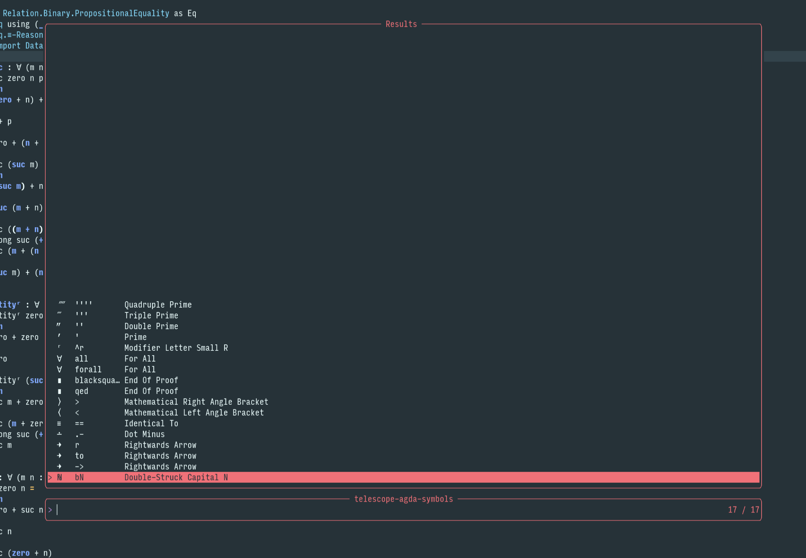

# telescope-unicode-input

[Telescope](https://github.com/nvim-telescope/telescope.nvim) extension to type
unicode (or any kind of) symbols easily. Perfect for typing agda code.



## Installation

Using [packer.nvim](https://github.com/wbthomason/packer.nvim):

```lua
return require("packer").startup(function(use)
  -- Install packer itself, if not already done
  use("wbthomason/packer.nvim")
  -- Install telescope
  use({
    "nvim-telescope/telescope.nvim",
    tag = "0.1.0",
    requires = { "nvim-lua/plenary.nvim" },
  })
  -- Install the extension
  use({
    "mbrea-c/telescope-unicode-input",
    config = function()
      require("telescope-unicode-input").setup({
        -- Setup any symbols you wish to use
        --  `value` is the text to be inserted
        --  `keys` is a table containing all desired shorthands for the simble
        --  `name` is a longer name for the unicode symbol, ideally the actual
        --         unicode name
        unicode = {
          { value = "ℕ", keys = { "bN" }, name = "Double-Struck Capital N" },
          { value = "→", keys = { "->", "to", "r" }, name = "Rightwards Arrow" },
          { value = "∸", keys = { ".-" }, name = "Dot Minus" },
          { value = "≡", keys = { "==" }, name = "Identical To" },
          { value = "⟨", keys = { "<" }, name = "Mathematical Left Angle Bracket" },
          { value = "⟩", keys = { ">" }, name = "Mathematical Right Angle Bracket" },
          { value = "∎", keys = { "qed", "blacksquare" }, name = "End Of Proof" },
          { value = "∀", keys = { "forall", "all" }, name = "For All" },
          { value = "ʳ", keys = { "^r" }, name = "Modifier Letter Small R" },
          { value = "′", keys = { "'" }, name = "Prime" },
          { value = "″", keys = { "''" }, name = "Double Prime" },
          { value = "‴", keys = { "'''" }, name = "Triple Prime" },
          { value = "⁗", keys = { "''''" }, name = "Quadruple Prime" },
        },
      })
    end,
    requires = { "nvim-telescope/telescope.nvim" },
  })
end
```

## Usage examples

### agda

If writing agda, it may be useful to bind this plugin to a key in insert mode.
For example, adding this in your `init.lua` will load this extension and bind
its action to `\\` on insert mode when editing lua files:

```lua
local function setup_agda_input()
  require("telescope").load_extension("unicode-input")
  vim.keymap.set("i", "\\", function()
    vim.cmd("Telescope unicode-input find")
  end, {})
end

local agda_augroup = vim.api.nvim_create_augroup("AgdaUnicodeInput", {})
vim.api.nvim_clear_autocmds({ group = agda_augroup })
vim.api.nvim_create_autocmd("Filetype", {
  group = agda_augroup,
  pattern = "agda",
  callback = setup_agda_input,
})
```

The `agda` filetype may not be recognized by neovim by default. If so, add this
to your `init.lua`:

```lua
vim.filetype.add({
  extension = {
    agda = "agda",
  },
})
```
